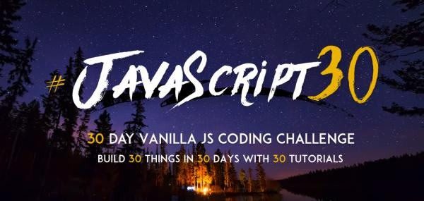

# 30 Days Vanilla JS Coding Challenge  :stuck_out_tongue_winking_eye:

This is repository for 30 days vanillaJS coding challenge. It's created for practical [free JavaScript course from Wes Bos](https://javascript30.com/). So, when I join to this course, I've started my 30 days coding challenge. 

For me it works like this:

1. Just watch - what, we have to create. :rocket:
2. Start from designinig simple web page, using HTML & CSS3, check that all looks fine and go ahead to JS part  :smiling_imp:
3. Make JS code for this small app. No frameworks, no libraries, just Vanilla JS. If I stuck on some problems, :ghost: I look at [learn.javascript](https://learn.javascript.ru/) and other places like MDN, w3schools and so on. If it doesn't work  I'll watch video from course to figure out. :muscle:
4. When web page is done and everything looks fine :+1:, I can look at my JS code and think about, how I can make it better :sparkles:
 
 Also after first two coding challenges I've decided to create [pretty nice frontpage](https://dmitryvdovichencko.github.io/vanillaJS-30days/) with this projects. Hopefully, it looks fine  :laughing:

